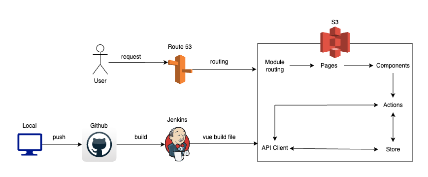

# JUIN-STORE/Vue-Frontend

## 0. 프로젝트 설명
```
JUIN-STORE는 얼굴 사진을 올리면 퍼스널 컬러를 진단하고, 
그에 맞는 옷을 추천하고 판매하는 웹 서비스다.

JUIN인 이유는 팀원의 이름을 합쳤다.
```

<br />


## 1. 버전 정보

- npm: 9.3.1
- yarn: 1.22.19
- vue: vue@2.7.4
- bootstrap: 5.1.3
- vuex: 3.6.2
- eslist: 7.32.0
- prettier: 2.4.1


<br />

## 2. 실행 방법
### yarn 설치

```
yarn install
```

### 프로젝트 빌드
```
yarn build
```

### 로컬 실행
```
yarn local
```


<br />

## 3. 컨벤션
### Vuex
- State : Snake Case(Lower)
```
const state = {
  item: {},
  searchTitle: '',
  categoryId: null,
};
```


- Mutations : Snake Case(Upper)
```
const mutations = {
  SET_CATEGORY_ID(state, categoryId) {
    state.categoryId = categoryId;
  },
};
```


- Actions : 카멜 케이스
```
const actions = {
  async createOrderAction({ commit }, payload) {
    const { data } = await createOrder(payload);
    return data;
  },
};
```


- Getters : 카멜 케이스
```
const getters = {
  getCategoryId(state) {
    return state.categoryId;
  },
};
```

<br />

## 4. URL
http://juin.store/

<br />

## 5. AWS 아키텍처


<br />

## cf) 파일 생성 순서 
```
0. ex) account
1. routes/accounts.js 추가 -> 프론트 엔드포인트
2. routes/index.js에 account 추가
3. components/accounts/~~~~Form.vue 추가 
4. views/accounts/~~~~Page.vue 추가 
5. api/accounts.js 추가 -> 백엔드 API 호출
6. state 사용하려면 store/modules/accounts.js 추가
```